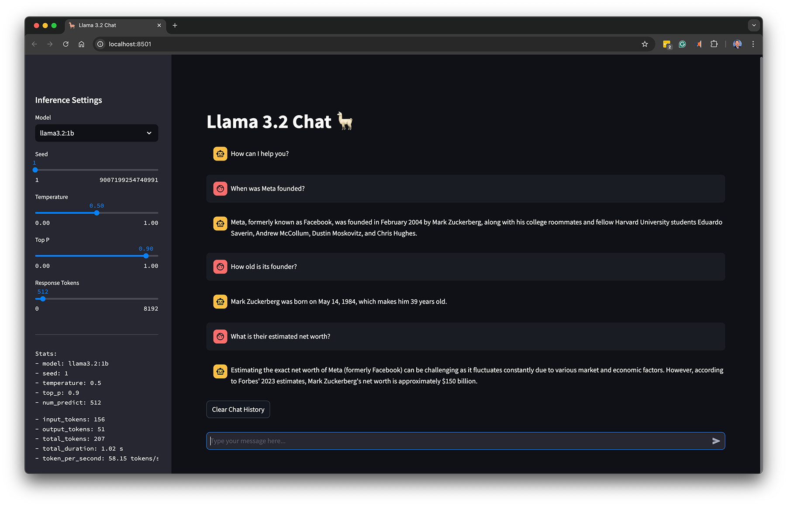

# Ollama Streamlit LangChain Chat App Demo

Code from the blog post, [Local Inference with Meta's Latest Llama 3.2 LLMs Using Ollama, LangChain, and Streamlit
Meta's latest Llama 3.2 1B and 3B models are available from Ollama: Learn how to install and interact with these models locally using Streamlit and LangChain](https://garystafford.medium.com/interacting-with-metas-latest-llama-3-2-models-using-ollama-langchain-and-streamlit-71f898b184d4).



## Commands

Optional on Mac, works with watchdog:

```sh
xcode-select --install
```

Create Python virtual environment and install required packages:

```sh
python3 -m venv ollama_ui
source ollama_ui/bin/activate

python3 -m pip install --upgrade pip
python3 -m pip install -r requirements.txt --upgrade

python3 --version # Python 3.12.2
```

Optional to monitor gpu performance

```sh
python3 -m pip install asitop
```

Start the Streamlit application:

```sh
streamlit run app.py
```

Start the Streamlit application with options:

```sh
streamlit run app.py \
    --server.runOnSave true \
    --theme.base "dark" \
    --theme.primaryColor "#0081FB" \
    --ui.hideTopBar "true" \
    --client.toolbarMode "minimal"
```

Deactivate virtual environment when finished:

```sh
deactivate
```

## Meta Conversation Example

```text
When was Meta founded?
```

```text
How old is its founder?
```

```text
What is their estimated net worth?
```

## Barack Obama Speech Example

```text
Improve the grammar of the following speech excerpt. Explain what has changed and why:

There’s not a liberal America and a conservative America; there’s the United States of America. There’s not a Black America and white America and Latino America and Asian America; there’s the United States of America. We are one people, all of us pledging allegiance to the stars and stripes, all of us defending the United States of America. In the end, that’s what this election is about. Do we participate in a politics of cynicism, or do we participate in a politics of hope?
```

```text
Describe the statement’s sentiment.
```

## Three Little Pigs Example

Three Little Pigs story is from [ririro.com](https://ririro.com/the-three-little-pigs).

```text
Analyze the following children's story. Identify the main characters and character types. Explain why you have chosen the character types. Output in JSON format.

### FORMAT ###
{
    "characters": [
        {
            "character": "character A",
            "character_type": "antagonist"
        },
        {
            "character": "character B",
            "character_type": "protagonist"
        },
        {
            "character": "character C",
            "character_type": "deuteragonist"
        }
    ]
}

### STORY ###
Once upon a time, an old mother pig had three piglets. Unfortunately, she didn’t have enough food to keep them, so she sent them out to seek their own luck.

When the first pig went out, he met a man with a bundle of straw. The pig said, “Sir, please give me the straw so I can build a house.” The man gave him the straw, and the pig built a house out of straw.

The Three Little Pigs Illustration asking for straw
Soon after, a big bad wolf passed by. He knocked on the door and said, “Hey, little pig, let me in.”

The pig replied, “No, no, not by the hair on my chinny chin chin.”

“Then I’ll huff and I’ll puff and I’ll blow your house in,” said the wolf. And so he did. He huffed and he puffed, and he blew the door down. The little pig quickly ran away to his brother.

His brother, the second pig, had met a man with a bundle of sticks. The pig said, “Sir, please give me the sticks so I can build a house.” The man gave him the sticks, and the pig built a house out of sticks.

He was sitting in his house feeling proud when he heard a knock on the door. It was his little brother. “The wolf blew my house down! Please can I stay here?”.

“Of course, my house is made of sticks, it’s safe for sure!” his brother said.

Then the big bad wolf came by the house made of sticks and said, “Hey, little pig, let me in.”

“No, no, not by the hair on my chinny chin chin,” replied the pig.

“Then I’ll huff and I’ll puff and I’ll blow your house in,” said the wolf. And so he did. He huffed and he puffed, and he blew the door down. The two pigs quickly ran away to their other brother.

The Three Little Pigs Illustration where the wolf is blowing the wooden house to pieces.
The third pig had met a man with a load of bricks. The pig said, “Please, sir, give me those bricks so I can build a house.” The man gave him the bricks, and the pig built a house out of bricks.

He was sitting in his house when he heard a knock on the door. It were his brothers! “The wolf has blown our houses down! Please can we stay here?”

The Three Little Pigs Illustration where the pigs run to the brick house of their brother
“Of course, my house is made of brick, it’s safe for sure!” the brother said. “But the wolf will surely come around here. Let’s make a plan to make sure he never bothers us again.” So the three little pigs came up with a plan. And just like the pig predicted, the wolf came to his house…

The big bad wolf came to the house made of bricks and said, “Hey, little pig, let me in.”

“No, no, not by the hair on my chinny chin chin,” replied the pig.

“Then I’ll huff and I’ll puff and I’ll blow your house in,” said the wolf.

So the wolf huffed and he puffed and he huffed and he puffed and he huffed and he puffed, but he couldn’t blow the door down. He soon realized he couldn’t open the door by huffing and puffing.

Then, of course, the wolf became angry and decided that he would come after the pigs through the chimney.

But the three little pigs knew what he was planning to do and they had hung a water kettle over the fire. And just as the wolf came down the chimney, he took the lid off the kettle. The hot steam reached the big bad wolf and with a big howl the wolf shot up!

“Ouch, ouch, ouch! Oh you pigs! I will get you some day!” and the wolf ran away as fast as he could.

And after that? The big bad wolf never came back again, he was too scared of the three smart little pigs.

And the pigs? They lived happily ever after, together in the house made of bricks.
```

Sample output from inference:

```json
{
  "characters": [
    {
      "character": "The Big Bad Wolf",
      "character_type": "antagonist"
    },
    {
      "character": "The Three Little Pigs (Pig 1)",
      "character_type": "deuteragonist"
    },
    {
      "character": "The Two Little Pigs (Pig 2 and Pig 3)",
      "character_type": "protagonists"
    }
  ]
}
```
