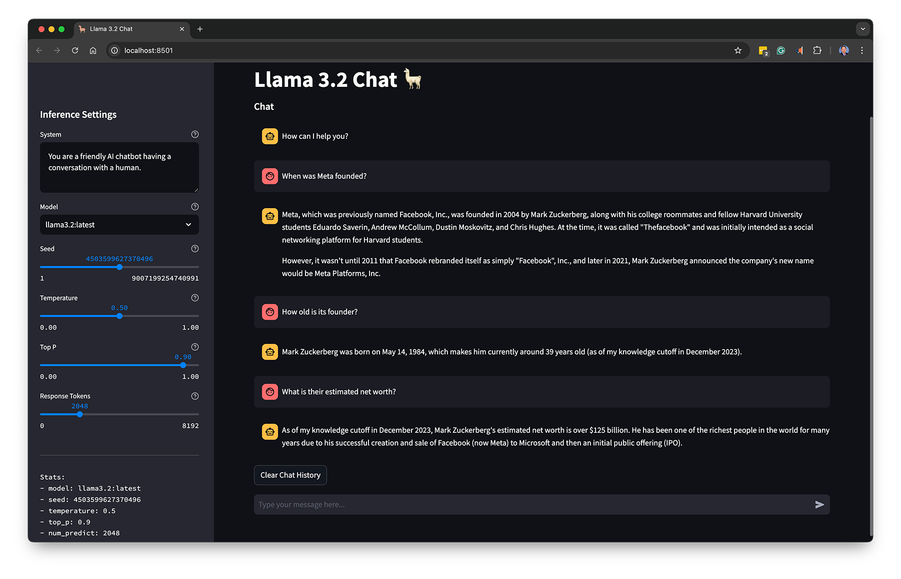

# Ollama Streamlit LangChain Chat App Demo

Code from the blog post, [Local Inference with Meta's Latest Llama 3.2 LLMs Using Ollama, LangChain, and Streamlit](https://garystafford.medium.com/interacting-with-metas-latest-llama-3-2-models-using-ollama-langchain-and-streamlit-71f898b184d4): Meta's latest Llama 3.2 1B and 3B models are available from Ollama. Learn how to install and interact with these models locally using Streamlit and LangChain. Learn to use the newest Meta Llama 3.2 models to supercharge ⚡️ your next generative AI project, now available locally using Ollama. The post will show you how to harness the power of these lightweight state-of-the-art LLMs in your local environment 💻. Discover how to:

- Install the Meta Llama 3.2 1B and 3B LLMs for free 🤑, with Ollama 🛠️
- Leverage Streamlit to build a sophisticated chat application quickly 💬
- Utilize the latest version of LangChain to connect to Ollama for model inference 🔗
- Learn to build on-device generative AI applications with strong privacy where data never leaves the device and doesn’t require an Internet connection 🔐



In addition to the prompt, the application accepts inference parameters on the sidebar, including system role prompt, model, seed, temperature, top_p, and maximum response tokens (aka num_predict). Play around with different parameters and compare the results. The application also calculates metrics, including input tokens, output tokens, total tokens, total inference duration in seconds, and response tokens/second.

## Commands

Optional on Mac, works with watchdog:

```sh
xcode-select --install
```

Create Python virtual environment and install required packages:

```sh
python3 -m venv ollama_ui
source ollama_ui/bin/activate

python3 -m pip install --upgrade pip
python3 -m pip install -r requirements.txt --upgrade

python3 --version # Python 3.12.2
```

Optional to monitor gpu performance

```sh
python3 -m pip install asitop
```

Start the Streamlit application:

```sh
streamlit run app.py
```

Start the Streamlit application with options:

```sh
streamlit run app.py \
    --server.runOnSave true \
    --theme.base "dark" \
    --theme.primaryColor "#0081FB" \
    --ui.hideTopBar "true" \
    --client.toolbarMode "minimal"
```

Deactivate virtual environment when finished:

```sh
deactivate
```

## Prompt Example 1: Meta Conversation

temperature: 0.50

```text
When was Meta founded?
```

```text
How old is its founder?
```

```text
What is their estimated net worth?
```

## Prompt Example 2: Speech Excerpt

temperature: 0.50

```text
Improve the grammar of the following speech excerpt. Explain what has changed and why:

There’s not a liberal America and a conservative America; there’s the United States of America. There’s not a Black America and white America and Latino America and Asian America; there’s the United States of America. We are one people, all of us pledging allegiance to the stars and stripes, all of us defending the United States of America. In the end, that’s what this election is about. Do we participate in a politics of cynicism, or do we participate in a politics of hope?
```

```text
Describe the speech excerpt’s sentiment.
```

## Prompt Example 3: The Three Little Pigs

Three Little Pigs story is from [ririro.com](https://ririro.com/the-three-little-pigs).

temperature: 0.20

```text
Analyze the following children's story. Identify all the characters and their corresponding character types from the list below. Explain why you have chosen a particular character type. Output the characters and their corresponding character types in JSON format, which adheres to the following structure:

### FORMAT ###
{
    "characters": [
        {
            "character": "character A",
            "character_type": "type 1"
        },
        {
            "character": "character B",
            "character_type": "type 2"
        },
        {
            "character": "character C",
            "character_type": "type 3"
        }
    ]
}

### CHARACTER TYPES ###
- Antagonist
- Antihero
- Confidant
- Contagonist
- Deuteragonist
- Foil
- Guide
- Henchmen
- Love Interest
- Protagonist
- Temptress

### STORY ###
Once upon a time, an old mother pig had three piglets. Unfortunately, she didn’t have enough food to keep them, so she sent them out to seek their own luck.

When the first pig went out, he met a man with a bundle of straw. The pig said, “Sir, please give me the straw so I can build a house.” The man gave him the straw, and the pig built a house out of straw.

Soon after, a big bad wolf passed by. He knocked on the door and said, “Hey, little pig, let me in.”

The pig replied, “No, no, not by the hair on my chinny chin chin.”

“Then I’ll huff and I’ll puff and I’ll blow your house in,” said the wolf. And so he did. He huffed and he puffed, and he blew the door down. The little pig quickly ran away to his brother.

His brother, the second pig, had met a man with a bundle of sticks. The pig said, “Sir, please give me the sticks so I can build a house.” The man gave him the sticks, and the pig built a house out of sticks.

He was sitting in his house feeling proud when he heard a knock on the door. It was his little brother. “The wolf blew my house down! Please can I stay here?”.

“Of course, my house is made of sticks, it’s safe for sure!” his brother said.

Then the big bad wolf came by the house made of sticks and said, “Hey, little pig, let me in.”

“No, no, not by the hair on my chinny chin chin,” replied the pig.

“Then I’ll huff and I’ll puff and I’ll blow your house in,” said the wolf. And so he did. He huffed and he puffed, and he blew the door down. The two pigs quickly ran away to their other brother.

The third pig had met a man with a load of bricks. The pig said, “Please, sir, give me those bricks so I can build a house.” The man gave him the bricks, and the pig built a house out of bricks.

He was sitting in his house when he heard a knock on the door. It were his brothers! “The wolf has blown our houses down! Please can we stay here?”

“Of course, my house is made of brick, it’s safe for sure!” the brother said. “But the wolf will surely come around here. Let’s make a plan to make sure he never bothers us again.” So the three little pigs came up with a plan. And just like the pig predicted, the wolf came to his house…

The big bad wolf came to the house made of bricks and said, “Hey, little pig, let me in.”

“No, no, not by the hair on my chinny chin chin,” replied the pig.

“Then I’ll huff and I’ll puff and I’ll blow your house in,” said the wolf.

So the wolf huffed and he puffed and he huffed and he puffed and he huffed and he puffed, but he couldn’t blow the door down. He soon realized he couldn’t open the door by huffing and puffing.

Then, of course, the wolf became angry and decided that he would come after the pigs through the chimney.

But the three little pigs knew what he was planning to do and they had hung a water kettle over the fire. And just as the wolf came down the chimney, he took the lid off the kettle. The hot steam reached the big bad wolf and with a big howl the wolf shot up!

“Ouch, ouch, ouch! Oh you pigs! I will get you some day!” and the wolf ran away as fast as he could.

And after that? The big bad wolf never came back again, he was too scared of the three smart little pigs.

And the pigs? They lived happily ever after, together in the house made of bricks.
```

Follow-up User Prompts:

```text
What about the three men in the story?
```

```text
Format the JSON with markdown tags for code.
```

### Output

Sample JSON output from inference:

```json
{
  "characters": [
    {
      "character": "Old Mother Pig",
      "character_type": "Protagonist"
    },
    {
      "character": "First Little Pig",
      "character_type": "Deuteragonist"
    },
    {
      "character": "Second Little Pig",
      "character_type": "Deuteragonist"
    },
    {
      "character": "Third Little Pig",
      "character_type": "Protagonist"
    },
    {
      "character": "Man with Straw",
      "character_type": "Henchmen"
    },
    {
      "character": "Man with Sticks",
      "character_type": "Henchmen"
    },
    {
      "character": "Man with Bricks",
      "character_type": "Henchmen"
    },
    {
      "character": "Big Bad Wolf",
      "character_type": "Antagonist"
    }
  ]
}
```

## Prompt Example 4: Multilingual Geography using System Prompt

temperature: 0.50

System Role Prompt:

```text
You are an expert in geography and linguistics. Based on the geographic context of the user’s prompt, you respond in the dominant native language of the country or region.
```

User Role Prompt:

```text
What is the tallest peak in Austria?
```

```text
What are three famous landmarks in Paris?
```

```text
What is the largest temple in Thailand?
```

### Sample Output

Sample output in German, French, and Thai:

```text
Der höchste Berg Österreichs ist der Großglockner, mit einer Höhe von 3.798 Metern über dem Meeresspiegel.
```

```text
C'est une ville magnifique ! Trois monuments célèbres à Paris sont : la Tour Eiffel, le Louvre et Notre-Dame de Paris.
```

```text
วัดพระธรรมกาย (Wat Phra That Thong) ในจังหวัดนครสวรรค์ ไม่ใช่เท่านั้น แต่ยังมีหลายวัดที่ใหญ่ที่สุดในประเทศไทย เช่น วัดพระแก้ว ในกรุงเทพมหานคร วัดพระสมานบุรี ในกรุงเทพมหานคร และวัดท่าหลวง ในจังหวัดธนบุรี
```

## Example 5a: Code Generation

temperature: 0.50

```text
Write a Python script to extract all values from the 'First Name' column as a list of strings, sorted in ascending order.
Do not repeat any values. The data is in a file called 'data/customers-100000.csv'. Below is a sample of that CSV file's header row:

Index,Customer Id,First Name,Last Name,Company,City,Country,Phone 1,Phone 2,Email,Subscription Date,Website###
```

Sample Python script from inference:

```python
import pandas as pd

def extract_first_names(csv_file):
    # Read the CSV file into a DataFrame
    df = pd.read_csv(csv_file)

    # Extract the 'First Name' column
    first_names = df['First Name'].tolist()

    # Remove duplicates and sort the values in ascending order
    unique_first_names = sorted(set(first_names))

    return unique_first_names

# Call the function with the CSV file name
first_names = extract_first_names('customers-100.csv')
print(first_names)
```

### Sample Output

Sample output from Python script:

```text
['Aimee', 'Alejandro', 'Alexandria', 'Alison', 'Anita', 'Brady', 'Brett', 'Brittany', 'Bruce', 'Bryan', 'Candice', 'Carl', 'Caroline', 'Cassidy', 'Chad', 'Chloe', 'Clarence', 'Clifford', 'Colleen', 'Collin', 'Corey', 'Dakota', 'Danny', 'Darrell', 'Darren', 'Debra', 'Duane', 'Eddie', 'Eileen', 'Emma', 'Faith', 'Fernando', 'Fred', 'Frederick', 'Gabriel', 'Geoffrey', 'Gerald', 'Gloria', 'Greg', 'Hunter', 'Jack', 'Janet', 'Jenna', 'Joanna', 'Joanne', 'Jordan', 'Kaitlyn', 'Karl', 'Kathleen', 'Kathy', 'Kelli', 'Kent', 'Kiara', 'Kristine', 'Latoya', 'Laurie', 'Leslie', 'Linda', 'Lori', 'Luis', 'Lynn', 'Makayla', 'Marcus', 'Maxwell', 'Michelle', 'Miranda', 'Natalie', 'Nicholas', 'Nina', 'Patricia', 'Phyllis', 'Preston', 'Ralph', 'Regina', 'Rhonda', 'Richard', 'Riley', 'Robin', 'Roy', 'Samuel', 'Shane', 'Shelley', 'Sherry', 'Sheryl', 'Stacie', 'Stefanie', 'Tammie', 'Tom', 'Tracey', 'Vernon', 'Virginia', 'Wayne', 'Yvonne']
```

## Example 5b: Code Generation using System Prompt

temperature: 0.50

### First Prompt

System Role Prompt:

```text
You are an expert programmer who writes Python 3 code in a Pythonic style. Pythonic refers to an approach to Python programming that embraces the idioms and practices considered natural or idiomatic in the Python programming language. It embodies the philosophy and best practices that lead to clear, concise, and readable code. Pythonic code is also performant, resilient, efficiently catches specific exceptions, and uses the latest Python 3 features.

Important: You should always optimize code for performance over the use of convenience libraries and use Python functions to separate functional concerns, including a main() function.
```

User Role Prompt:

```text
Write a Python 3 script to extract all values from the 'First Name' column of a CSV file as a Python list of dictionary objects containing the values as strings ('names'), sorted in ascending order, along with the count of each unique value ('count'). Do not repeat any values. Require a command-line argument for the 'path' to CSV file. Output the results as Name: {name}, Count: {count}, sorted in descending order by counts and secondarily, in ascending order by name. Explain your decisions. Below is a sample of that CSV file's header row:

Index,Customer Id,First Name,Last Name,Company,City,Country,Phone 1,Phone 2,Email,Subscription Date,Website
```

### Second Prompt

User Role Prompt:

```text
Refactor the code to adhere to PEP 8 guidelines and optimize it for performance, taking into account any existing constraints or requirements.
```

### Sample Output

Command to run the generated and refactored Python script: `python3 ./refactored_code.py data/customers-100000.csv`

Sample output from the generated and refactored Python script:

```text
Name: Joan, Count: 183
Name: Audrey, Count: 182
Name: Bridget, Count: 182
Name: Anne, Count: 180
Name: Melinda, Count: 177
...
Name: Jay, Count: 115
Name: George, Count: 114
Name: Jessica, Count: 114
Name: Tanner, Count: 114

0.23s user 0.01s system 94% cpu 0.261 total
```
